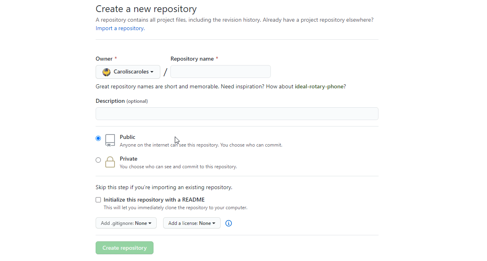

# Introdução

1) Primeiramente: você precisa [criar uma conta](https://github.com/) no Github.

2) No primeiro cenário, vamos abordar a situação onde você quer começar o seu próprio projeto. Futuramente neste guia demonstraremos como contribuir em um projeto que não é seu.
Primeiramente, clique no botão ilustrado abaixo para iniciar o processo de criação de um novo repositório.

    

Basta dar um nome bem bonito e clicar para proceder no botão.

    

`Mas o que é um repositório? É tipo uma pasta, resumidamente. A única diferença é que todos arquivos são versionados e podemos "voltar no passado" caso alguma coisa dê errado.`

1) Após criado o repositório
