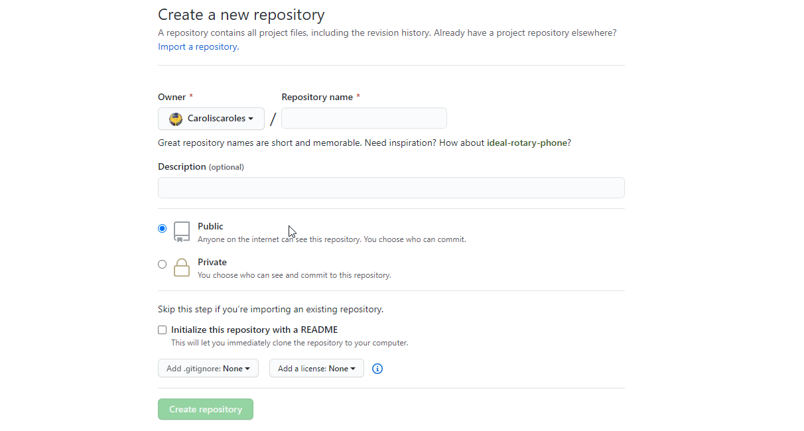
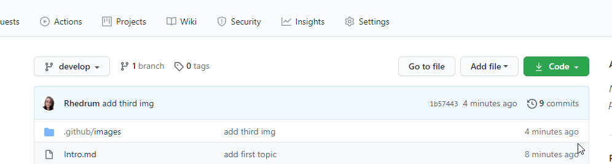
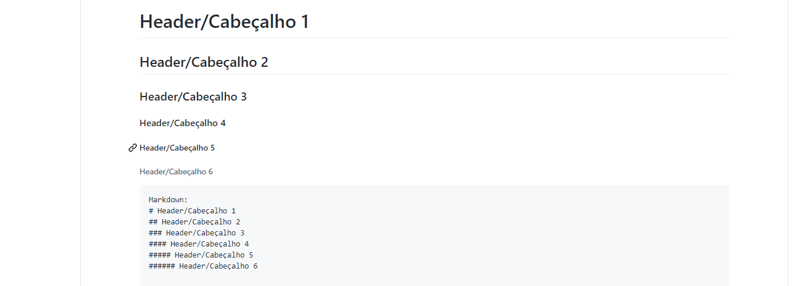
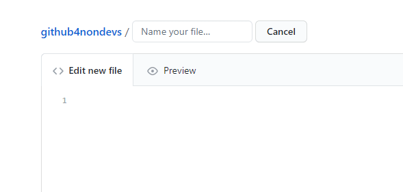
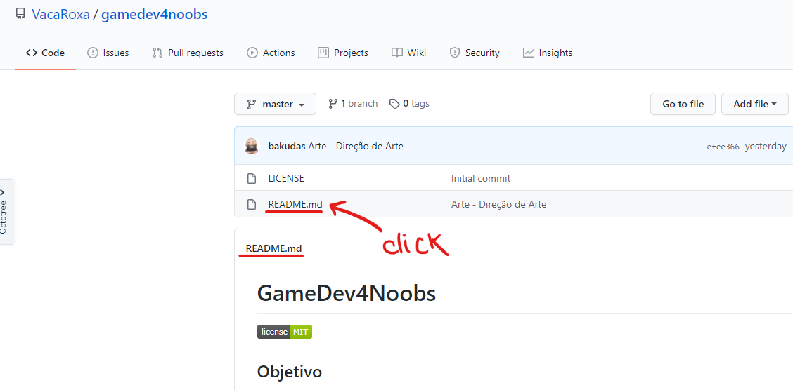
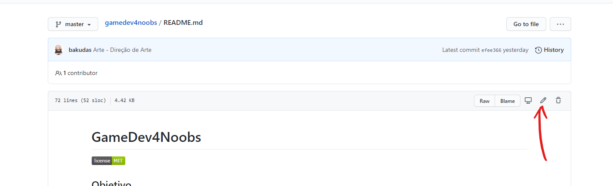
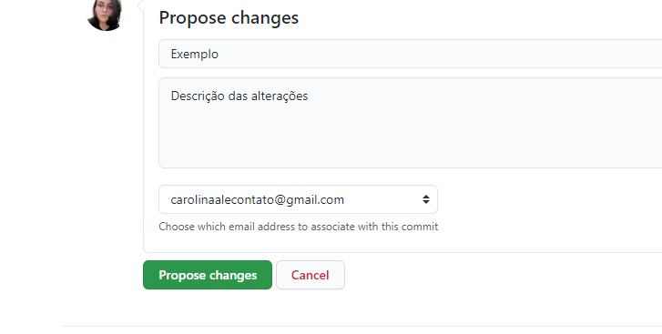
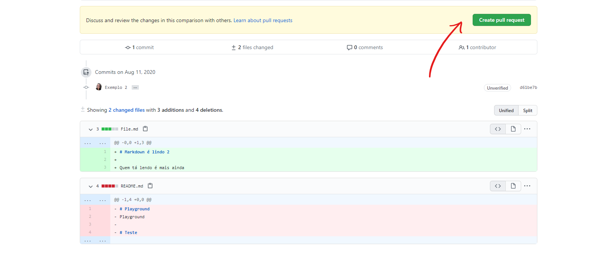
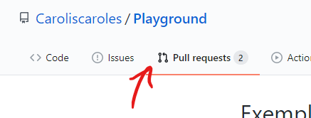

<p align="center">
  <a href="https://github.com/he4rt/4noobs" target="_blank">
    
  </a>
</p>

<p align="center">
  <h2 align="center">Github4nondevs</h2>
  
  <p align="center">
    <a href="https://github.com/Rhedrum/github4nondevs/issues">Report Bug</a>
    ·
    <a href="https://github.com/Rhedrum/github4nondevs/issues">Request Feature</a>
  </p>
</p>

# Introdução

Neste tutorial será ensinado o básico de como contribuir em projetos usando apenas a interface do Github pelo navegador.
O tutorial é destinado a pessoas não desenvolvedoras ou qualquer um que não queira usar a interface de comandos para desfrutar do Github.

Lembre-se que você precisa [criar uma conta](https://github.com/) no Github para os próximos passos.

# Criando seu próprio projeto

1) No primeiro cenário, vamos abordar a situação onde você quer começar o seu próprio projeto. Futuramente neste guia também será demonstrado como contribuir em um projeto que não é de sua autoria.
   
    Clique no botão ilustrado abaixo para iniciar o processo de criação de um novo repositório.

<p align="center"">
    
<p/>

<p align="center"">
    Basta dar um nome ao repositório e clicar para proceder, no botão.
<p/>

<p align="center"">
    
<p/>

```Caso você se pergunte "Mas o que é um repositório?": É tipo uma pasta, resumidamente. A única diferença é que existem técnicas para que todos arquivos sejam versionados e seja possível "voltar no passado" caso alguma coisa dê errado.```


2) Após criado o repositório, é hora de começarmos a povoá-lo com arquivos.

    Na raíz do projeto, crie um arquivo único ou uma pasta, como preferir. Basta dar um nome ao arquivo e colocar sua extensão.

   `Exemplo: nomeDoArquivo.txt`

<p align="center"">
    
<p/>

Basta salvar e está pronto. Agora vamos falar de markdown.


# Markdown

Markdown é uma forma bem simples de formatar textos e que se tornou bastante popular por esse motivo. Aqui no Github ele é especialmente útil (esse texto foi feito usando markdown, por exemplo.)

[Aqui](https://github.com/jpaulohe4rt/markdown4noobs/blob/master/src/Guia/Cheatsheet.md) você pode encontrar um guia bem completo da sintaxe do markdown. Com ele é possível demarcar diferentes tamanhos de títulos, inserir links, imagens, montar tabelas e muito mais.

<p align="center"">
    
<p/>

Para usufruir do markdown, basta que você nomeie seu arquivo com a extensão **.MD**

`Exemplo: nomeDoArquivoMarkdown.MD`

<p align="center"">
    
<p/>

# Contribuindo com outros projetos

Ao encontrar um novo projeto do qual você queira contribuir, basta navegar até o arquivo desejado e abrí-lo em uma nova aba.

<p align="center"">
    
<p/>

Na nova aba, observe o símbolo de uma caneta logo no topo do arquivo, é onde você precisa clicar para abrir o **modo de edição**.


<p align="center"">
    
<p/


Após feitas todas alterações desejadas, basta rolar até o final da página e confirmar a proposta das mudanças no arquivo. 

<p align="center"">
    
<p/

Na próxima página, um resumo de tudo que foi adicionado (em verde) ou removido (em vermelho) será exibido, confira se tudo está correto e peça a aprovação!

<p align="center"">
    
<p/

Sua solicitação ficará em aberto na aba ilustrada abaixo e assim que alguma pessoa que cuida do repositório aprová-las elas entrarão oficialmente no arquivo principal.

<p align="center"">
    
<p/


Isso é tudo por hoje ;) Quaisquer dúvidas sinta-se livre para abrir uma Issue nesse repositório.

## Como Contribuir através da Interface de Comandos

Contribuições fazem com que a comunidade open source seja um lugar incrível para aprender, inspirar e criar. Todas contribuições
são **extremamente apreciadas**

1. Realize um Fork do projeto
2. Crie um branch com a nova feature (`git checkout -b feature/featureBraba`)
3. Realize o Commit (`git commit -m 'Add some featureBraba'`)
4. Realize o Push no Branch (`git push origin feature/featureBraba`)
5. Abra um Pull Request

## Autores

- **Carolina Ale** - _Developer & Member of He4rt Developers_  - [Twitter](https://twitter.com/caroliscaroles) - [Github](https://github.com/Rhedrum)

<p align="center">Made with 💜</p>

---

<p align="center">
  <a href="https://github.com/he4rt/4noobs" target="_blank">
    
  </a>
</p>